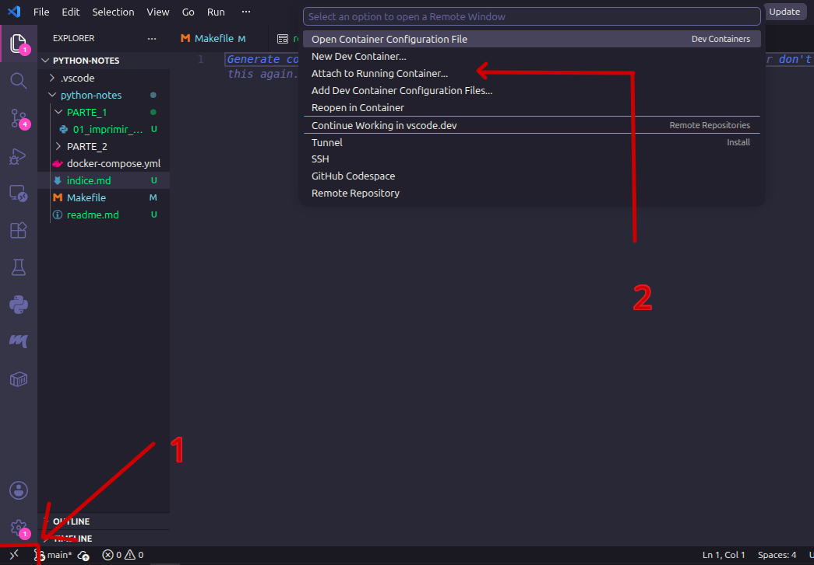

# PYTHON - NOTES

Respositorio de repaso y practicas de python cuenta docker para poder probar a version python 3.14

## Instalacion y Ejecucion de Docker

### Instalacion 

Despues de copiar el repositorio localmente

```bash
docker compose up -d
```
### Ejecucion 

#### Alternativa  1 : con Bash (con Makefile)

Levantamos el entorno 

```bash
Make up
```

Activamos Bash con la version python 3.14

```bash
Make entrar
```

#### Alternativa 2 : Bash + Visual Studio Code

Levantamos el entorno 

```bash
Make up
```

Con visual nos movemos al contendor de docker y usamos version python 3.14, para eso seguir paso 1 y 2 de la imagen.



## Verificacion : Avtivacion de Docker 

Muestra una lista de comando de docker en ejecuccion

```bash
docker ps 
```

O mostrar informacion general y configuracion de docker

```bash
docker info
```